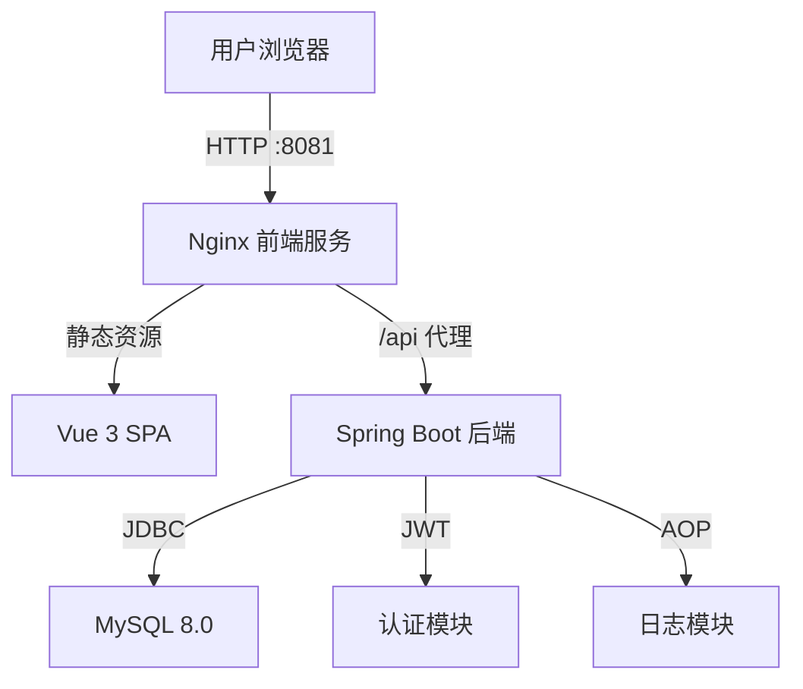
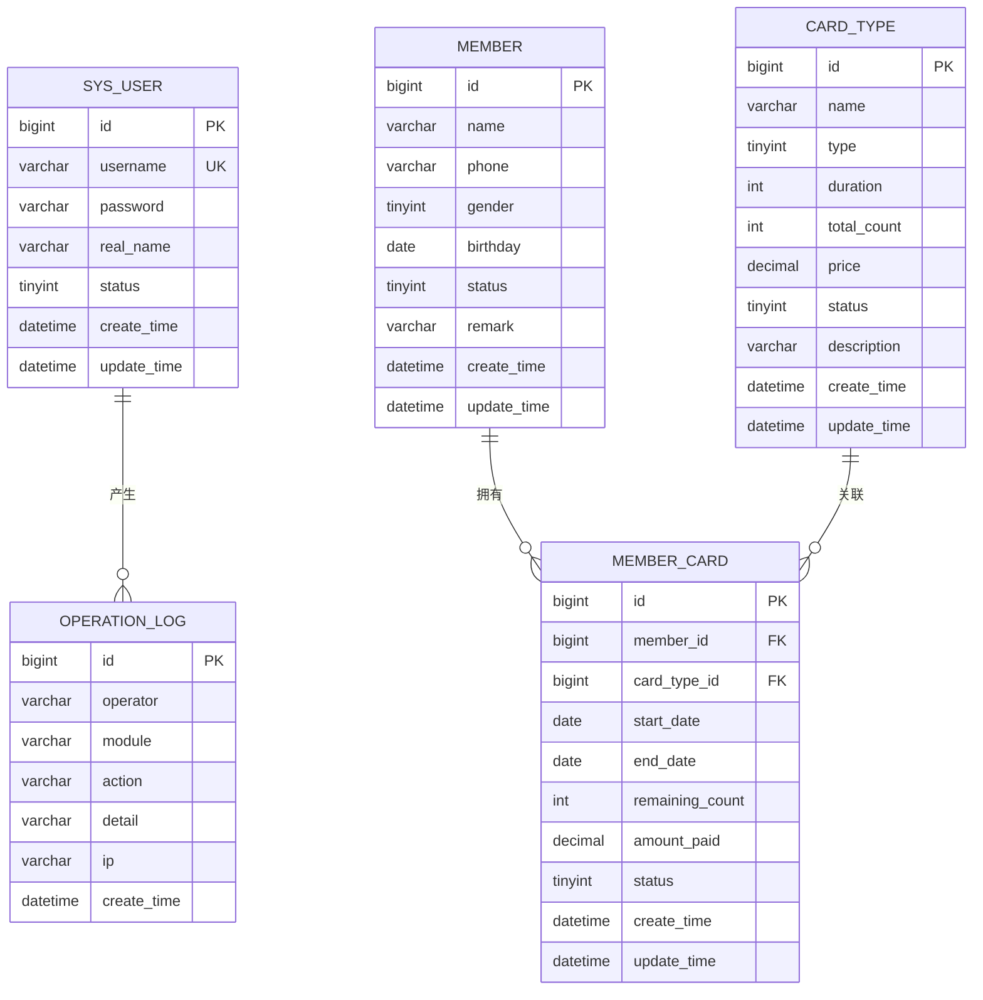

# 健身房会员管理系统 - 设计文档

## 系统架构

## ER 图

## 接口清单

### AuthController `/api/auth`
| 方法 | 路径 | 说明 |
|------|------|------|
| POST | /login | 用户登录 |
| GET | /info | 获取当前用户信息 |

### MemberController `/api/members`
| 方法 | 路径 | 说明 |
|------|------|------|
| GET | / | 分页查询会员列表 |
| GET | /{id} | 查询会员详情 |
| POST | / | 新增会员 |
| PUT | /{id} | 修改会员 |
| DELETE | /{id} | 删除会员 |

### CardTypeController `/api/card-types`
| 方法 | 路径 | 说明 |
|------|------|------|
| GET | / | 分页查询卡种列表 |
| GET | /list | 查询全部启用卡种 |
| GET | /{id} | 查询卡种详情 |
| POST | / | 新增卡种 |
| PUT | /{id} | 修改卡种 |
| DELETE | /{id} | 删除卡种 |

### MemberCardController `/api/member-cards`
| 方法 | 路径 | 说明 |
|------|------|------|
| GET | / | 分页查询开卡记录 |
| GET | /{id} | 查询开卡详情 |
| POST | / | 新增开卡 |
| PUT | /{id} | 修改开卡 |
| DELETE | /{id} | 删除开卡记录 |

### OperationLogController `/api/logs`
| 方法 | 路径 | 说明 |
|------|------|------|
| GET | / | 分页查询操作日志 |

### DashboardController `/api/dashboard`
| 方法 | 路径 | 说明 |
|------|------|------|
| GET | /stats | 获取统计概览数据 |

## UI/UX 规范

| 项目 | 值 |
|------|------|
| 主色调 | #4A6CF7 |
| 成功色 | #13CE66 |
| 警告色 | #E6A23C |
| 危险色 | #F56C6C |
| 背景色 | #F0F2F5 |
| 卡片圆角 | 8px |
| 正文字号 | 14px |
| 标题字号 | 16px / 20px |
| 间距基准 | 8px / 16px / 24px |
| 字体 | -apple-system, BlinkMacSystemFont, "Segoe UI", "PingFang SC", "Hiragino Sans GB", "Microsoft YaHei" |
